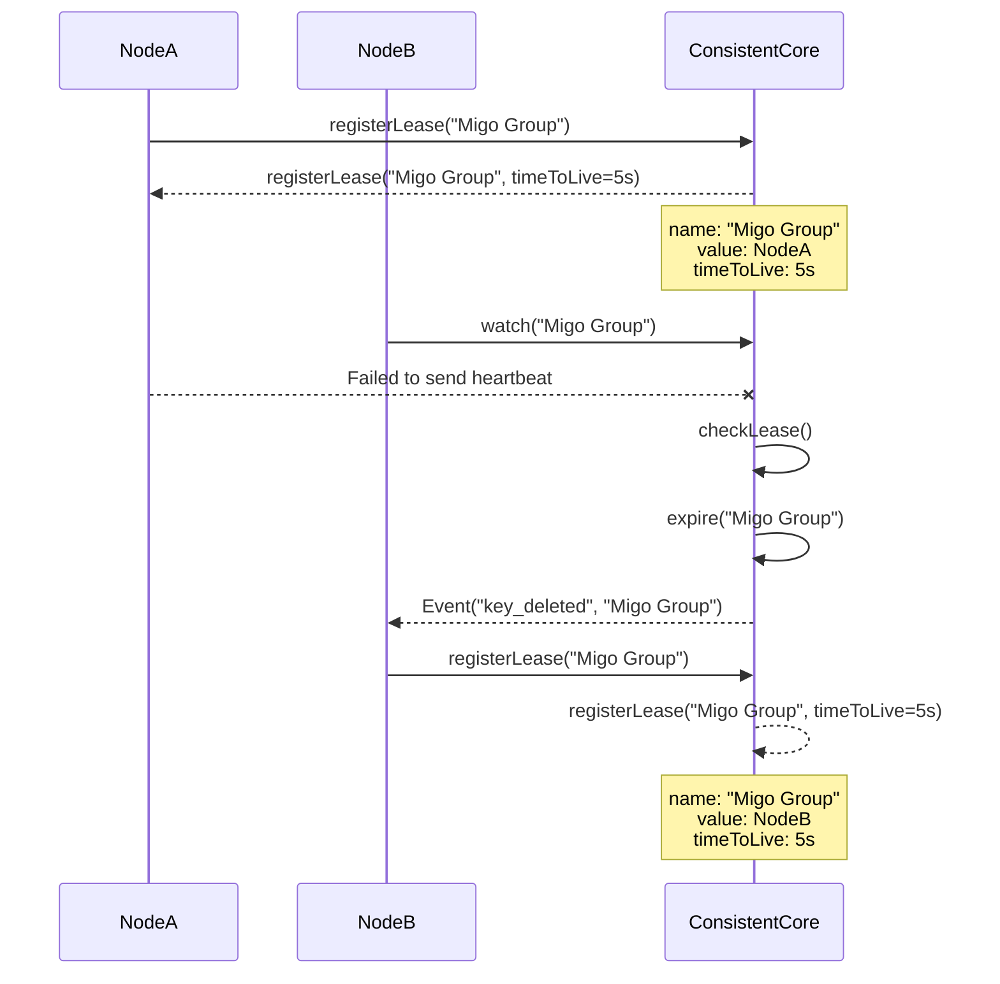

# Consistent Core: A Foundation for Distributed System Management

## Why Consistent Core?
In large-scale distributed systems with hundreds or thousands of nodes, effective cluster management becomes a critical challenge. These systems require reliable mechanisms to track node assignments within shards and maintain appropriate data partitioning strategies.

One of the fundamental challenges in distributed systems is maintaining key-to-partition mappings. Without a stable mapping strategy, every time nodes are added or removed from the cluster, the entire dataset would require redistribution—an impractical and resource-intensive operation in production environments.

While technologies like the **gossip protocol** and **consistent hashing** provide excellent scalability characteristics, certain critical operations demand stronger consistency guarantees. These operations include:

- Cluster membership metadata management
- Global configuration storage and updates
- Leader election processes
- Service discovery and registration

This is where a **Consistent Core** becomes invaluable. Production-grade implementations like Apache ZooKeeper and etcd serve as the coordination backbone for many of the world's largest distributed systems, providing the strong consistency guarantees needed for these critical operations while allowing the broader system to scale with eventually consistent approaches.

## How Consistent Core Works

A Consistent Core provides a reliable, strongly consistent key-value store that typically implements a consensus algorithm like Raft or Paxos. This ensures that all nodes in the system have the same view of critical metadata, even in the face of network partitions or node failures.

One key feature of Consistent Core systems is their **lease mechanism**, which enables automatic failover and recovery when nodes become unavailable.

## Lease-Based Failover Example
The following sequence demonstrates how a Consistent Core handles node ownership transitions through leases:

1. **NodeA** registers a lease for "Migo Group"
2. The Consistent Core grants a lease with a 5-second time-to-live (TTL)
3. **NodeB** sets up a watch on the "Migo Group" key to monitor changes
4. **NodeA** fails to send heartbeat messages to maintain its lease
5. The Consistent Core checks leases and expires the "Migo Group" lease
6. **NodeB** receives notification that the "Migo Group" key was deleted
7. **NodeB** registers itself as the new owner of "Migo Group"
8. The Consistent Core grants a new lease to **NodeB**

This mechanism ensures seamless failover when nodes become unavailable, helping maintain system stability without manual intervention.

## Benefits of Consistent Core

- **Automatic Failover**: The lease mechanism enables automatic recovery from node failures
- **Centralized Configuration**: Provides a single source of truth for critical system settings
- **Coordination Services**: Enables distributed locks, barriers, and other synchronization primitives
- **Service Discovery**: Allows dynamic service registration and discovery
- **Reduced Complexity**: Offloads complex consistency challenges to a specialized subsystem

## Implementation Considerations

When implementing or adopting a Consistent Core for your distributed system:

1. **Scale Appropriately**: Limit the Consistent Core to managing critical metadata, not application data
2. **Redundancy**: Deploy the Consistent Core across multiple availability zones/regions
3. **Monitoring**: Implement robust monitoring for the Consistent Core itself
4. **Caching**: Consider caching read-only data to reduce load on the Consistent Core
5. **Failure Handling**: Design clients to handle temporary Consistent Core unavailability

## Conclusion
A Consistent Core provides the strong consistency foundation needed for critical operations in distributed systems, while allowing the broader system to scale using eventually consistent approaches. By carefully separating concerns and using the right tool for each job, modern distributed systems can achieve both reliability and scalability.

Whether you implement your own Consistent Core or leverage battle-tested solutions like ZooKeeper or etcd, this architectural pattern has proven essential for managing today's complex distributed environments.