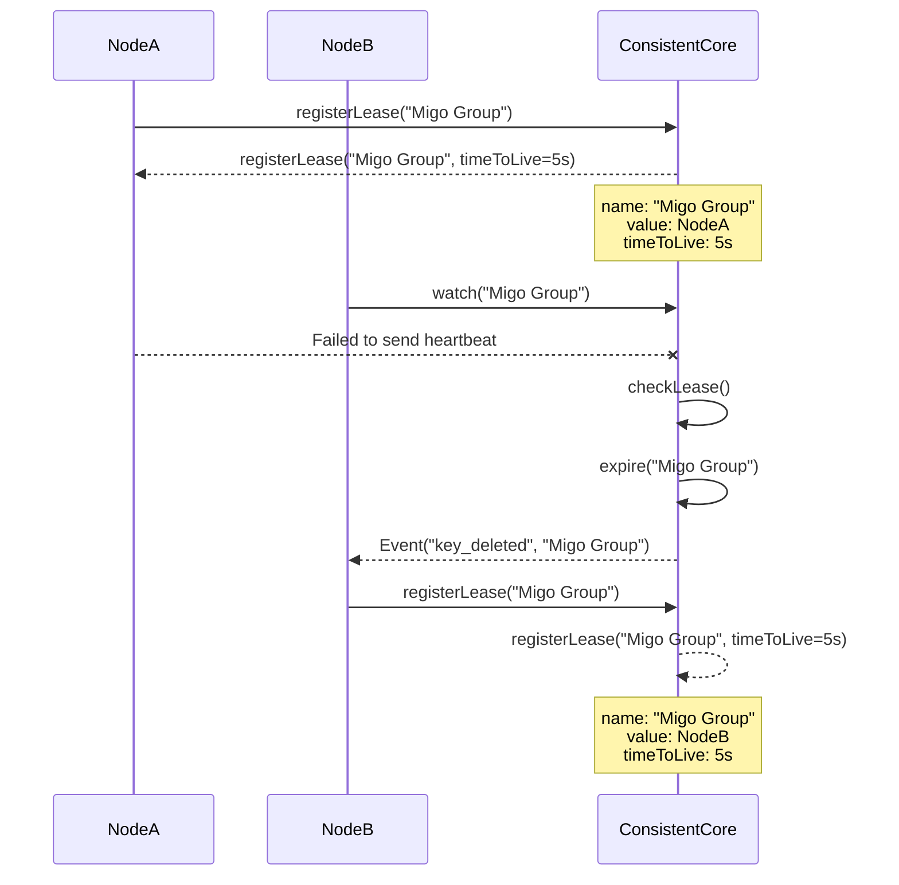

# Consistent Core POC 

## Why Consistent Core
Some distributed system may have hundreds or thousands of nodes. Managing such a cluster means we need to keep track of which nodes are parts of which
shards, for example. 

Additionally, we need a mapping of keys to logical partitions because otherwise, every time nodes are added or removed, the entire data set would need to be moved, which is impractical in large-scale systems.

While the `gossip protocol` and consistent hashing enable scalability, critical data operations (such as membership metadata, global configuration, or leader election) require stronger consistency. We can achieve this by consitent core. Zookeeper and etcd are proper implementation of this. 

## Flow
